# Brass Art · генеративные люстры из латуни

Латунные люстры, форму которых рисует программа, а отливает мастер. Каждый экземпляр уникален:
у каждого своё «зерно», и из него заново рождается рисунок. Литьё — в своей мастерской, по
мастер-моделям, напечатанным на 3D-принтере. Люстры собраны в семейства — у каждого своё
устройство, свои размеры и свой генератор.

**▶ Живое демо:** <https://a9252233314-dotcom.github.io/brassart-gen/> — сверху меню семейств:
нажмите на семейство, выберите вариацию, ширину и подвес. Генератор работает прямо в браузере,
и это тот же код, что готовит файлы для печати в цеху.

| Семейство | Что это | Демо |
|---|---|---|
| **CELL** | шар-решётка: литая сетка ячеек, форма шар / овал / волна / двойной | [открыть](https://a9252233314-dotcom.github.io/brassart-gen/) |
| **ЛЕПЕСТОК** | 12 литых лепестков в два яруса вокруг гранёной вазы | [открыть](https://a9252233314-dotcom.github.io/brassart-gen/lepestok.html) |
| **ОРБИТА** | гладкая лента из латунного листа делает витки вокруг свечей, как орбита | [открыть](https://a9252233314-dotcom.github.io/brassart-gen/orbita.html) |
| **СЛОИ** | тарелки-линзы ярусами на центральной трубе, свечи на каждом ярусе | [открыть](https://a9252233314-dotcom.github.io/brassart-gen/sloi.html) |

В окне 3D три сцены, переключатель — в углу:

- **Студия** — латунь на тёмном фоне в свете невидимых софтбоксов: видно форму и металл.
- **Интерьер** — современная столовая в духе генеративного дизайна: стена из вертикальных лент, каждая плавно
  закручивается по высоте (по стене идёт волна света и тени), стекло в пол с вечерним городом, стол-«стадион»
  из травертина на пьедесталах из слоёв, стулья-чаши в букле, рельеф из шестигранников, вазы и скульптура из слоёв.
- **Кабинет** — классическая столовая: орех, штукатурка, картина, окно в сумерки.

В комнатах светят только лампы люстры, в настоящих единицах и с затуханием по расстоянию; решётка и ленты
отбрасывают узор на потолок и стены, латунь отражает саму комнату, а выдержку сцена подбирает сама, как фотоаппарат.
Сразу виден размер: стол и потолок — настоящие.

| | |
|---|---|
| 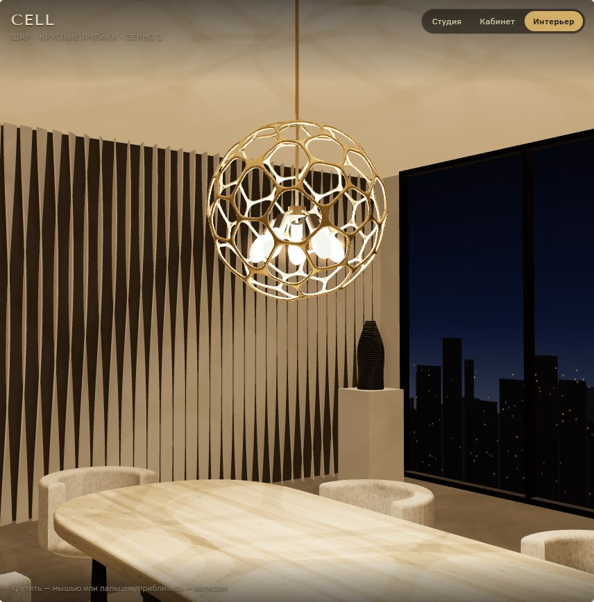 | 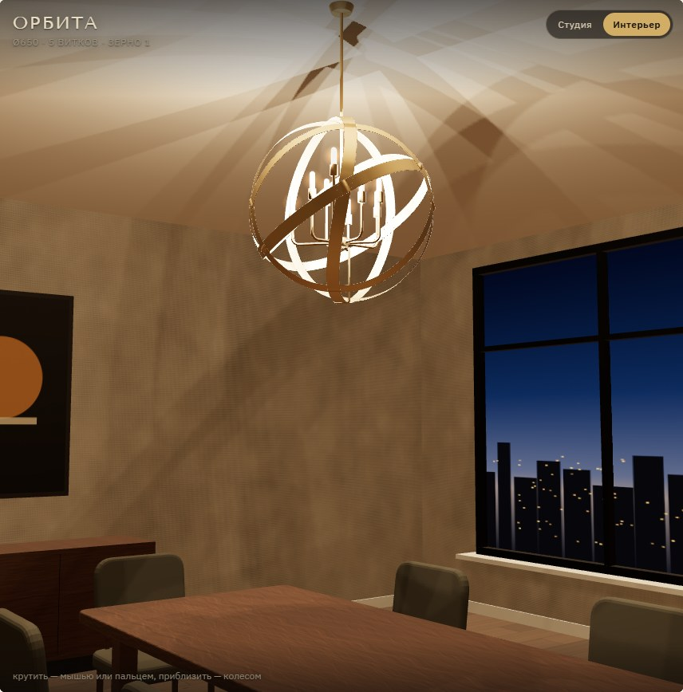 |
| 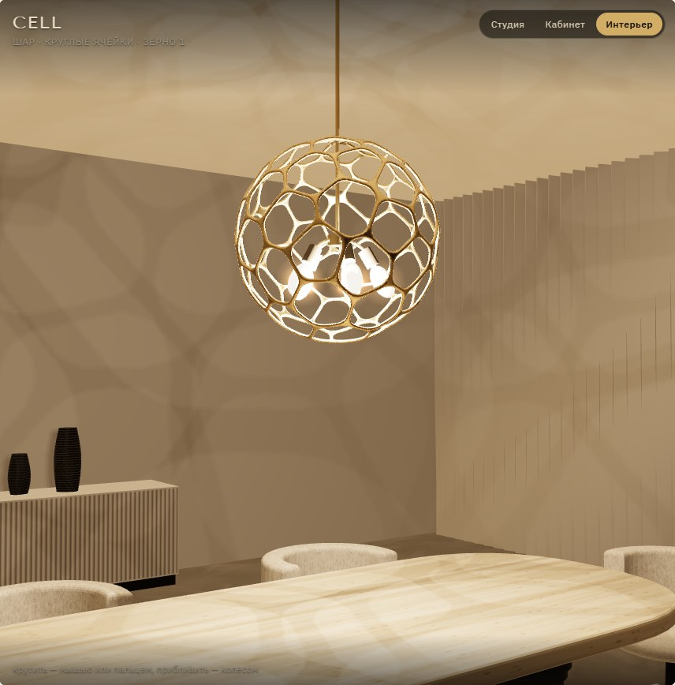 | 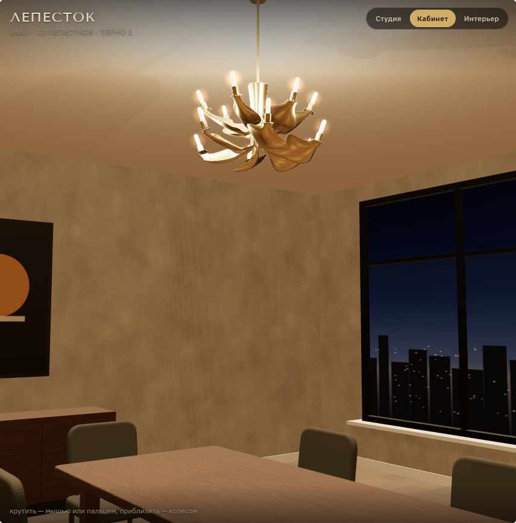 |

## CELL — шар-решётка

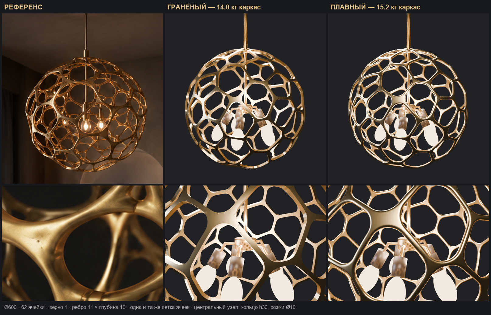

## Что уже есть

- **Шар Ø600, круглые ячейки** — первый к производству. Решётка из рёбер 11 мм с полукруглыми
  кромками (минимум для литья в землю), мягкие перепонки в узлах, 13.9 кг латуни.
- **Узор «капли»** — ячейки, вытянутые по меридиану.
- **Овал** — горизонтальная форма высотой 0.4 от ширины. Сама форма случайная от зерна и
  выравнивается так, чтобы центр тяжести был на оси и люстра висела ровно.
- **Размер задаётся шириной и числом ламп** (до 15): число ячеек растёт с диаметром, а генератор
  сам выбирает трубу центрального узла, класс крепления по весу и угол гиба рожков, чтобы лампы
  не касались решётки.

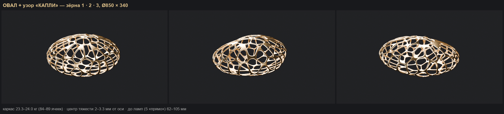

## ЛЕПЕСТОК — лепестки вокруг вазы

Двенадцать латунных лепестков в два яруса: верхние поднимают лампы высоко, нижние свисают. Лепестки
закручены «вихрем». Ширина и подвес — под интерьер заказчика; центр тяжести генератор держит на оси.

- **Лепесток — тонкая литая оболочка 2 мм**, открытый жёлоб: снаружи форма, внутри пусто, по жёлобу
  идёт провод к лампе. Льётся в двустороннюю форму из холоднотвердеющей смеси по печатной модели.
- **Две отливки на лепесток — ножка и лист**, сварка встык до полировки. Одной отливкой «вихрь» из формы
  не вынуть — генератор проверяет уклон под съём у каждого куска.
- **Готовые, отполированные лепестки крепятся к вазе двумя винтами M6** — без сварки, чтобы не сжечь
  патину. Ваза сверху открыта: штанга входит в неё и вкручивается в пластину на глубине 15 см.
- Ширина 600–850 мм, латунь 7.7–12.5 кг; на печать — 24 куска и ваза, всё влезает в стол принтера.

| | |
|---|---|
| 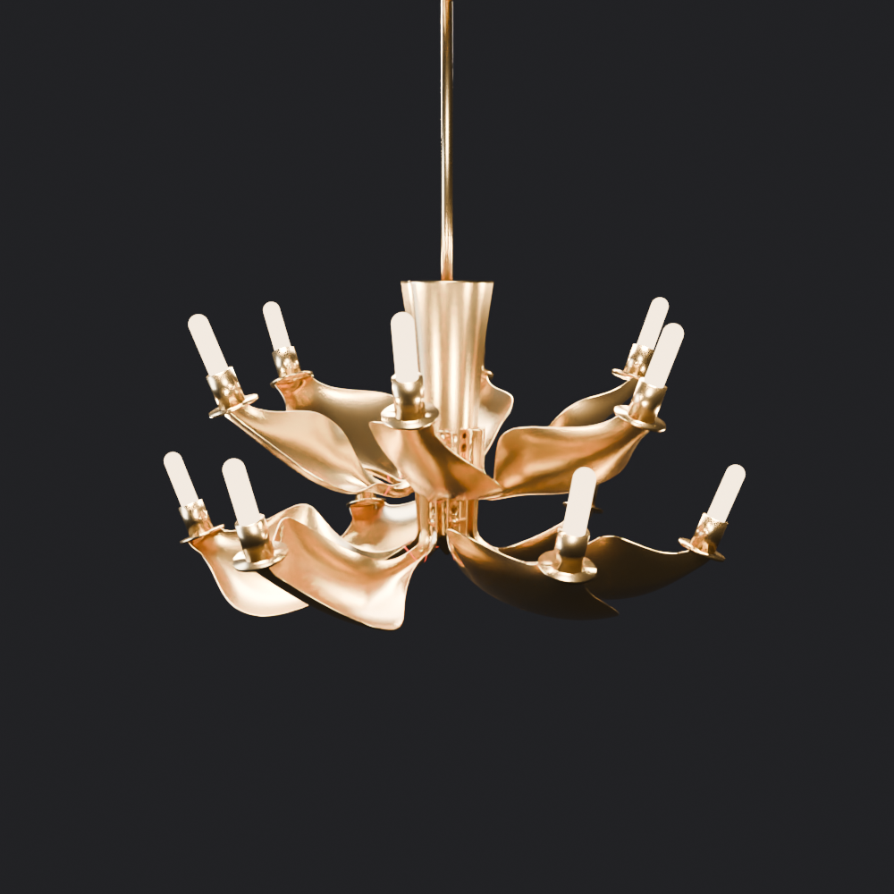 | 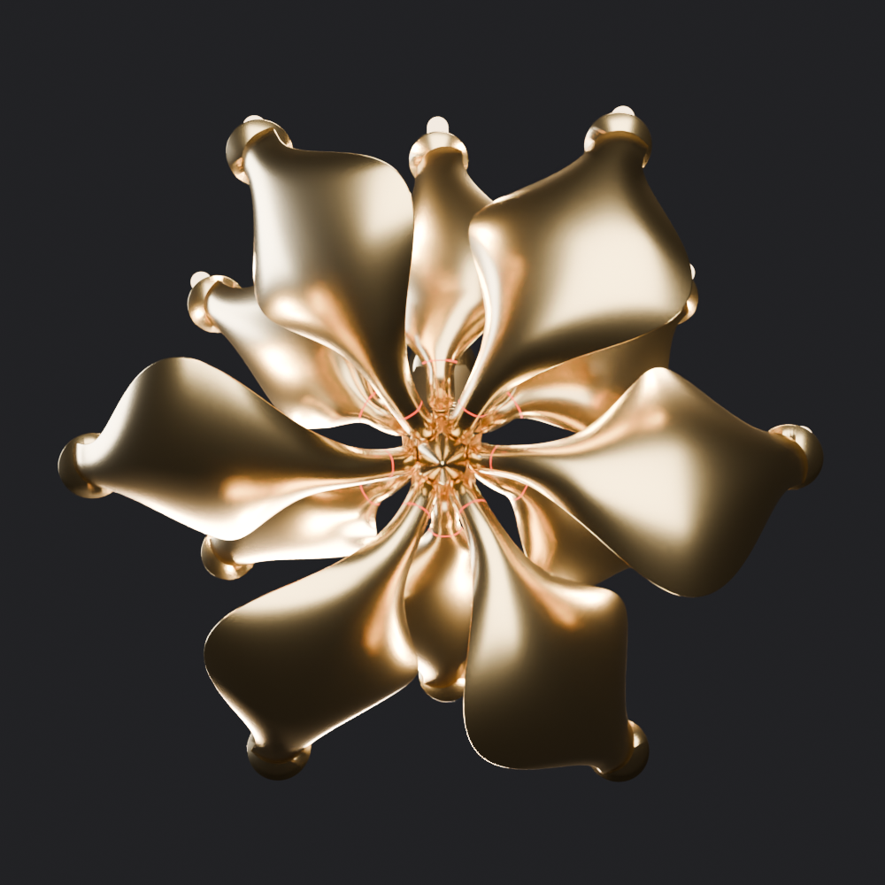 |

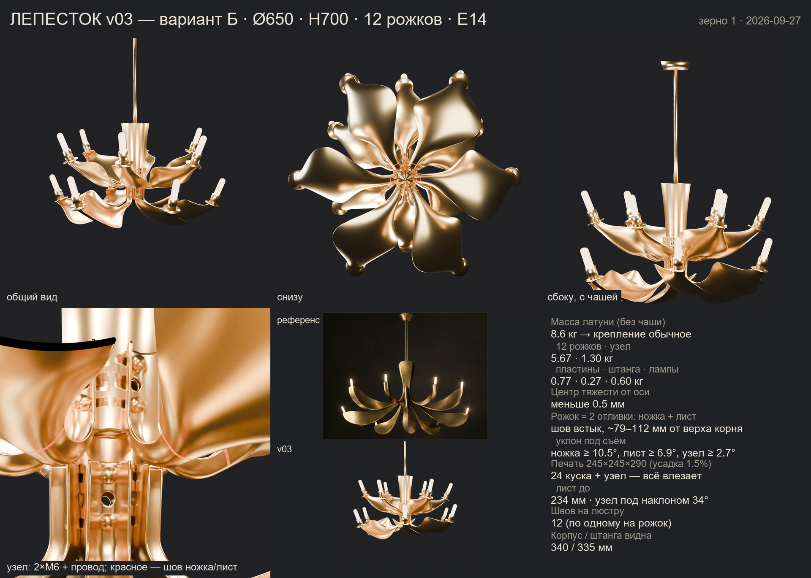

## ОРБИТА — лента-орбита

Одна гладкая лента из латунного листа делает несколько витков вокруг свечей, и каждый виток сдвинут относительно
прошлого — как орбита спутника. Наклон витков плавно меняется от пологого до полярного: полярный виток проходит ровно под
узлом и ложится в «лодочку» — петлю, на которой держится вся клетка. Матовая латунь: шлифовка и патина.

- **Лента — лист латуни средней твёрдости 1.5 мм, гладкая.** В пересечениях идёт то над, то под соседней (плетение), ленты
  лежат друг на друге плоско.
- **Крепления — литые накладки в форме «лежачего полицейского»** с одной горкой, только в пересечениях: ставятся сверху
  на ленту, болт M4 проходит сквозь ленты в накладку. Стыки полос листа тоже спрятаны в пересечениях — концы заходят друг
  на друга под накладкой. Накладка одна модель — много отливок.
- Генератор сам находит пересечения, проверяет, что ленты не проходят друг сквозь друга и не цепляют друг друга краями, и
  выдаёт **развёртки полос листа 1:1** с отверстиями под болты.
- Ø650, 5 витков — 7.2 кг латуни, 15 пересечений, 15 накладок, 6 полос листа.
- **Три вариации:** Классика — 5 витков; Лёгкость — 4 витка, больше воздуха (6.0 кг); Минимализм — 3 витка и всего
  три пересечения (4.8 кг).

| | |
|---|---|
| 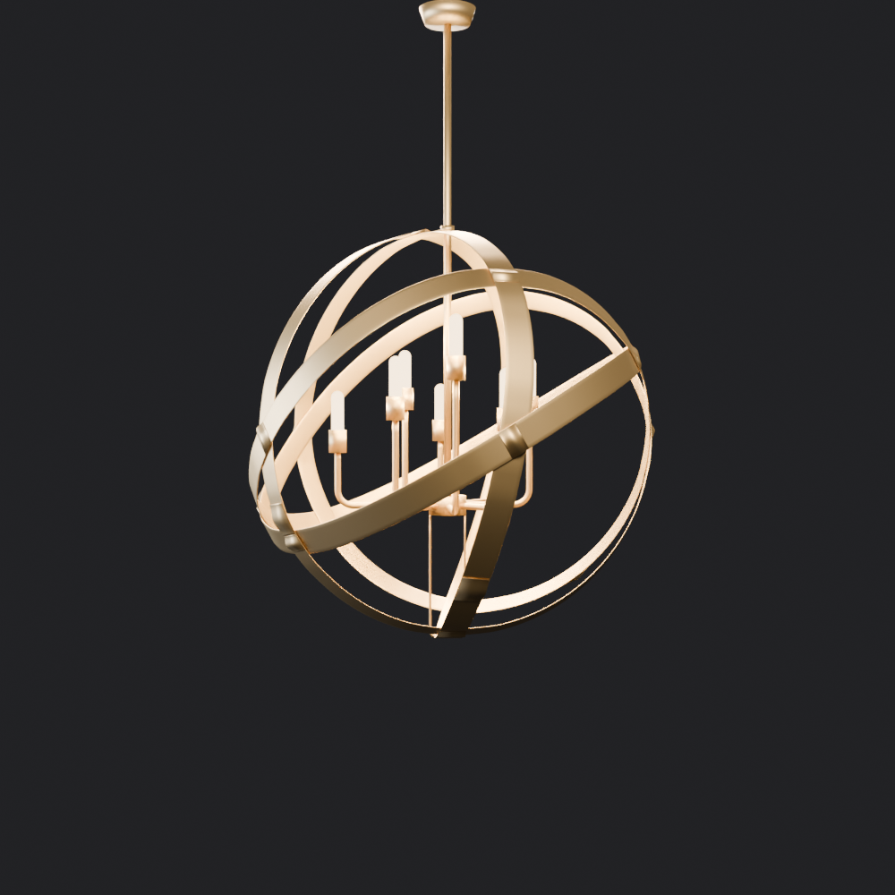 | 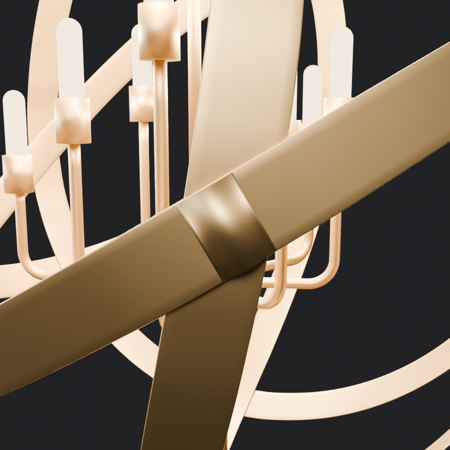 |

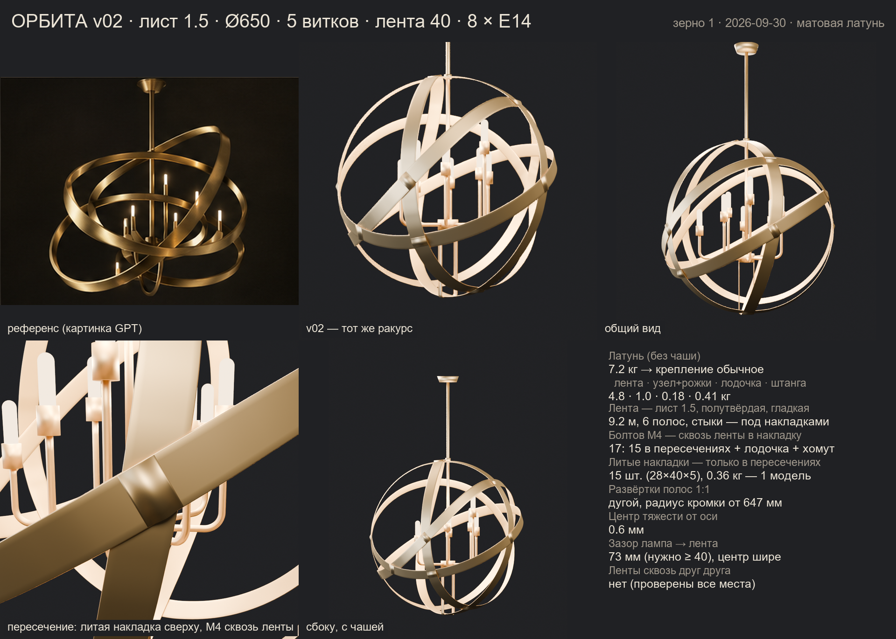

## СЛОИ — тарелки ярусами

Пять тарелок-линз «пагодой» на центральной латунной трубе M12 — шире всего в середине, свечи на каждом ярусе.

- **Тарелка — чаша и колпак ротационной вытяжки из латунного листа 0.8 мм**, стянутые по центру гайкой M12, без пайки:
  тарелка разбирается, провод внутри доступен. Верх — прямой конус, поэтому гильза лампы срезана под один угол и лампа стоит ровно.
- Три размера тарелок — три оправки у вытяжника; генератор выдаёт **чертёж каждой половины 1:1** для вытяжника.
- Ø650 — 13.1 кг латуни, 19 ламп G9 тёплого света. Ширина 650–800.

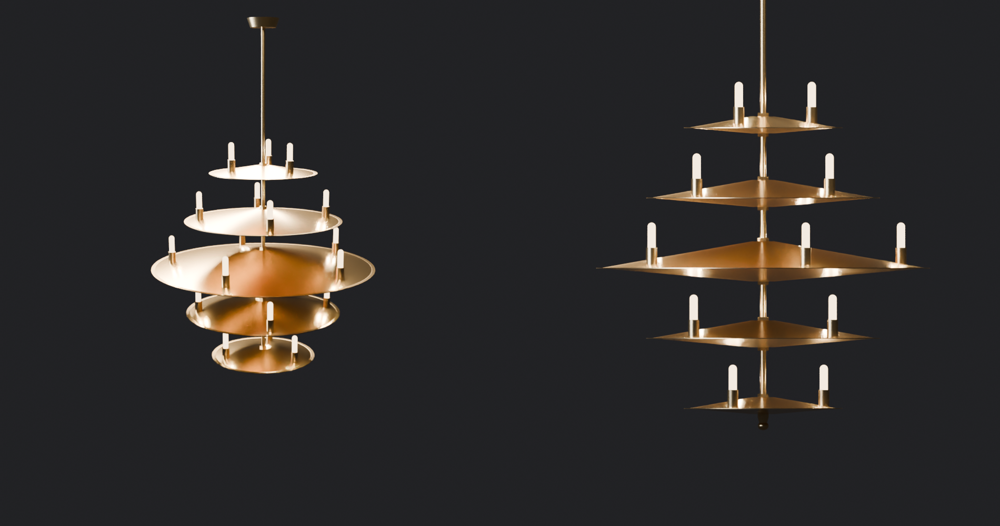

## Как это делается в цеху (CELL)

Тот же генератор режет изделие на панели под стол принтера: рез идёт только поперёк тонкого
ребра, подальше от узлов, стык встык под сварку. Шар Ø600 — 31 панель. Номер каждой панели
отливается выпуклыми цифрами изнутри и совпадает с шагом сборки, а к изделию печатается лист
сборки на стену.

| | |
|---|---|
| 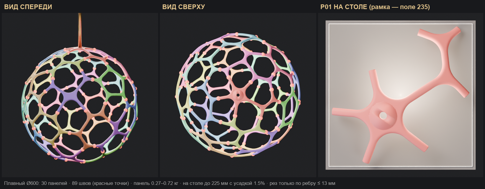 | 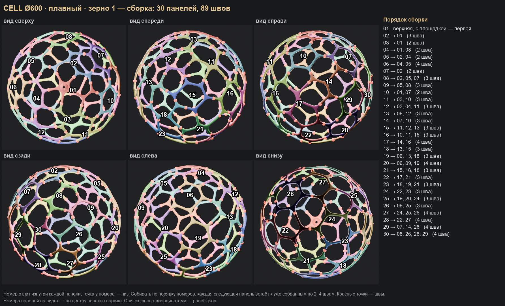 |
| 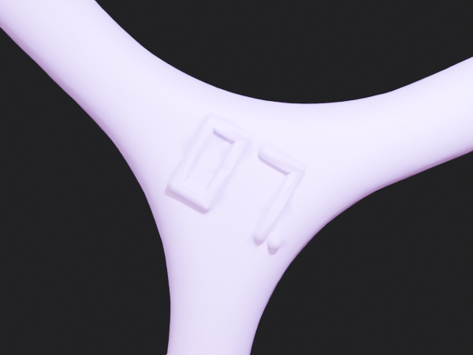 | 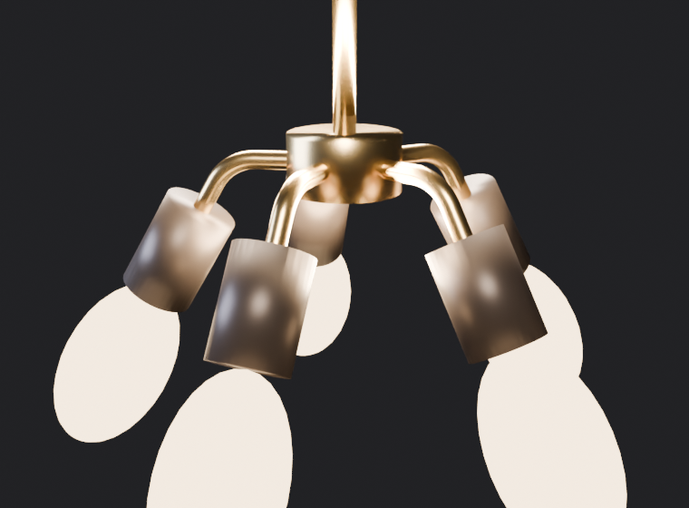 |

## Как устроен генератор

- Центры ячеек на поверхности → диаграмма Вороного → дыры: многоугольник ячейки, отступивший на
  полребра и скруглённый почти до овала.
- Металл описан функцией расстояния и собирается в сетку
  [manifold-3d](https://github.com/elalish/manifold) (WebAssembly).
- Проверки: минимальное сечение, масса → труба M10/M12 и крепление, зазор до ламп, центр тяжести,
  размер каждой панели под стол Flying Bear Reborn 2 с учётом усадки латуни.
- `generator/core.ts` — ядро без файлов (работает и в браузере), `generator/generate.ts` — запуск
  в цеху (STL, паспорт, панели, шаблон гиба рожка 1:1), `generator/panels.ts` — нарезка.
  Все параметры — в `params.json`.

- ЛЕПЕСТОК: `lepestok/generator/lepestok-core.ts` — ядро (и для браузера), `lepestok.ts` — запуск в цеху
  (мастер-модели ножек, листов и вазы с усадкой, вид в сборе, паспорт). Параметры — `lepestok/params.json`.

```bash
cd generator && npm i
node generate.ts ../params.json ../out                          # CELL (Node 24+): STL, паспорт, панели
cd ../lepestok/generator && npm i
node lepestok.ts ../params.json ../out                          # ЛЕПЕСТОК: куски под печать и паспорт
cd ../../orbita/generator && npm i
node orbita.ts ../params.json ../out                            # ОРБИТА: развёртки полос, накладки, паспорт
cd ../../sloi/generator && npm i
node sloi.ts ../params.json ../out                              # СЛОИ: чертежи половин тарелок для вытяжника, паспорт
cd ../.. && node web/build.mjs                                  # пересобрать сайт: index.html, lepestok.html, orbita.html, sloi.html
```

## Дальше

Первая пробная панель CELL уходит в печать и литьё. Следующее семейство — ПАЛЬМА. Потом — конфигуратор
на сайте студии: заказчик собирает свою люстру, мастер получает готовые файлы на печать.

---

© Brass Art. Все права защищены. Код и изображения открыты для знакомства с проектом;
для использования — свяжитесь с автором репозитория.
