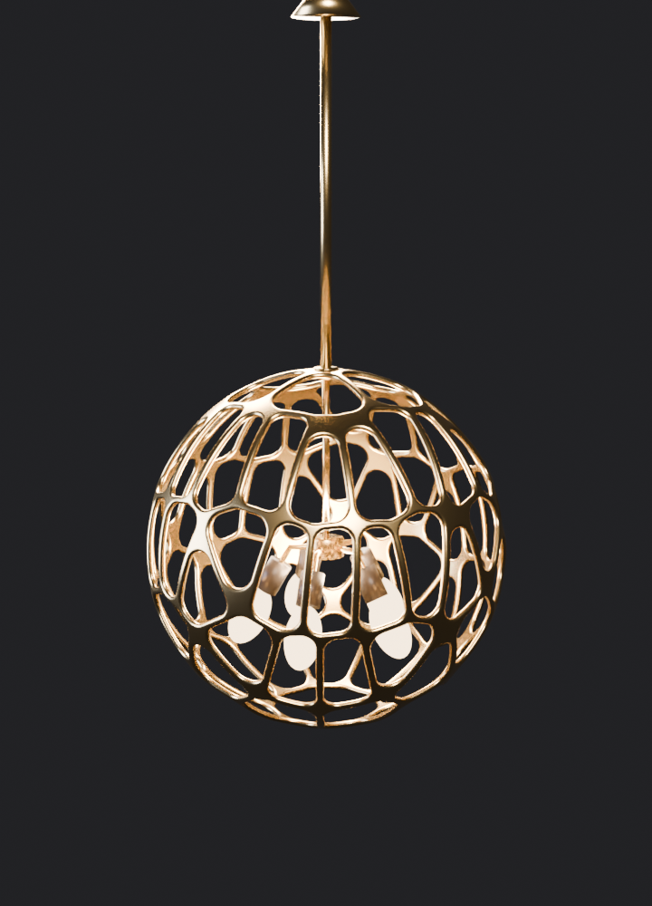
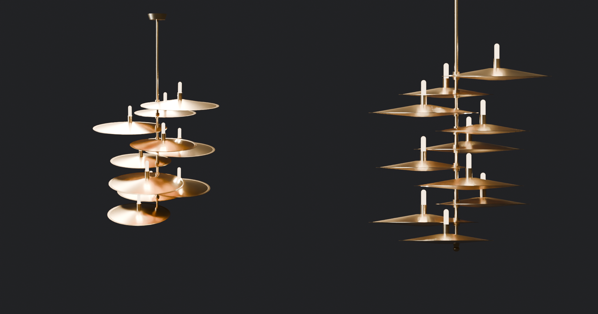
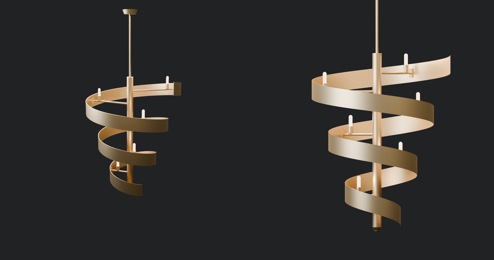
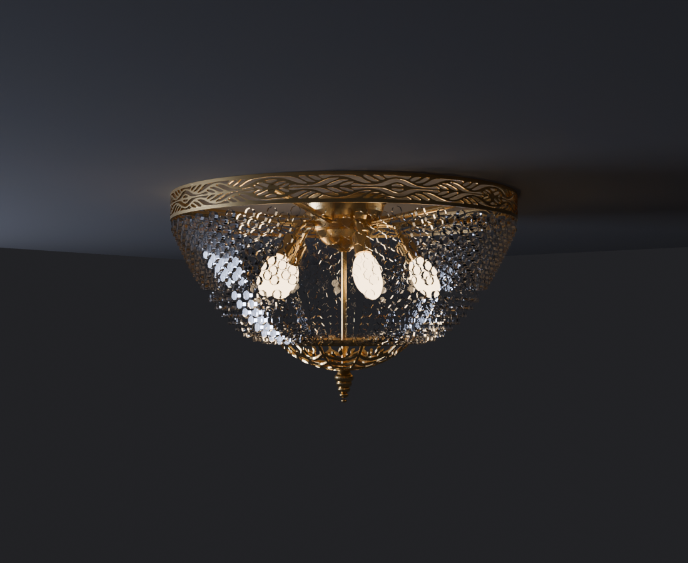

# Brass Art · генеративные люстры из латуни

Латунные люстры, форма которых рассчитывается под пространство, а отливает мастер в своей мастерской.
Люстры собраны в семейства, у каждого своё устройство и свои размеры.

**▶ Живое демо:** <https://a9252233314-dotcom.github.io/brassart-gen/> — сверху меню семейств: выберите семейство,
вариацию, ширину и подвес. Люстра собирается прямо в браузере, рядом — масса латуни и габарит.

| Семейство | Что это | Демо |
|---|---|---|
| **CELL** | шар-решётка из литой латуни: шар, овал, волна или двойной | [открыть](https://a9252233314-dotcom.github.io/brassart-gen/) |
| **ЛЕПЕСТОК** | двенадцать литых лепестков в два яруса вокруг гранёной вазы | [открыть](https://a9252233314-dotcom.github.io/brassart-gen/lepestok.html) |
| **ОРБИТА** | лента из латунного листа делает витки вокруг свечей, как орбита | [открыть](https://a9252233314-dotcom.github.io/brassart-gen/orbita.html) |
| **СЛОИ** | тарелки-линзы ярусами, свечи на каждом ярусе | [открыть](https://a9252233314-dotcom.github.io/brassart-gen/sloi.html) |
| **СПИРАЛЬ** | лента из латунного листа спиралью-воронкой, свечи на рожках | [открыть](https://a9252233314-dotcom.github.io/brassart-gen/spiral.html) |
| **КОЛЬЦО** · классика | ажурное кольцо и хрустальная корзина к потолку | [открыть](https://a9252233314-dotcom.github.io/brassart-gen/kolco.html) |

В окне 3D три сцены: **Студия** — металл в свете софтбоксов; **Кабинет** — классическая столовая;
**Интерьер** — комната в духе генеративного дизайна. В комнатах светят только лампы люстры, решётка и ленты
отбрасывают узор на стены и потолок, сразу виден настоящий размер.

| | |
|---|---|
|  |  |
|  |  |

## CELL

## ЛЕПЕСТОК

| | |
|---|---|
|  |  |

## ОРБИТА

## СЛОИ

## СПИРАЛЬ

## КОЛЬЦО

---

© Brass Art. Все права защищены. Модели, изображения и код страниц принадлежат автору; копирование и
использование без письменного разрешения запрещены. Связаться: info@brassart.ru
